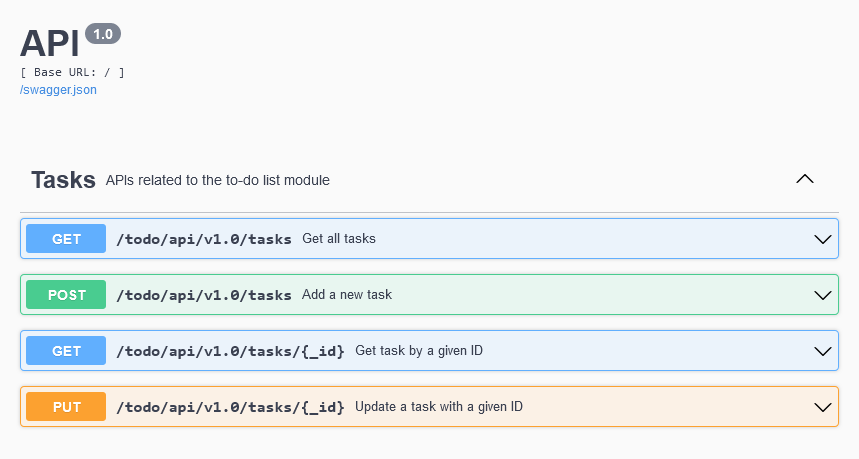

# Minimal RESTful API application with Flask and MongoDB

This repository offers an example of Flask application with REST API ready to be deployed on  Docker container.

#### RESTful endpoints

#### Tech Stack:

* Web framework: Flask
* Database: MongoDB
* Parsing/Validation: Pydantic
* API documentation using Swagger UI
* Containerization: Docker
* WSGI Server: Gunicorn

#### Features:

* Containerized Docker build
* Validation of data with Pydantic
* Tests covering each of the REST API
